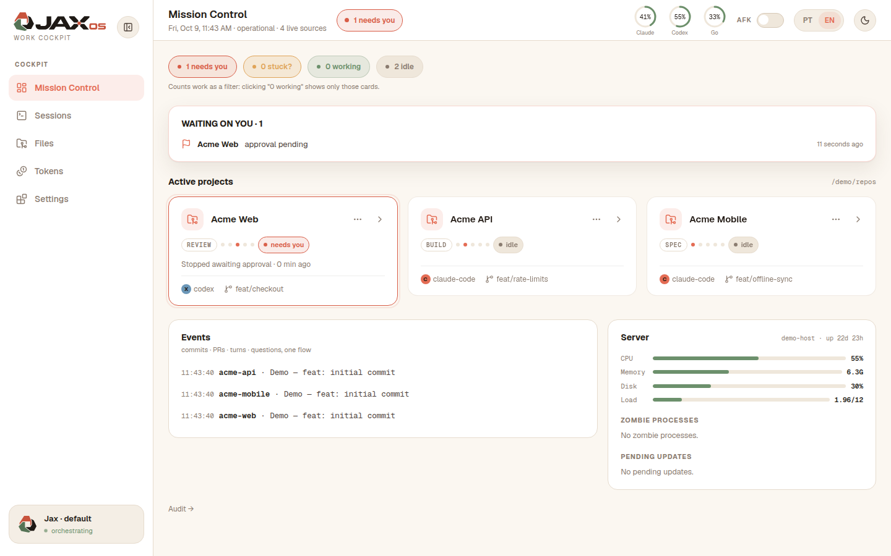
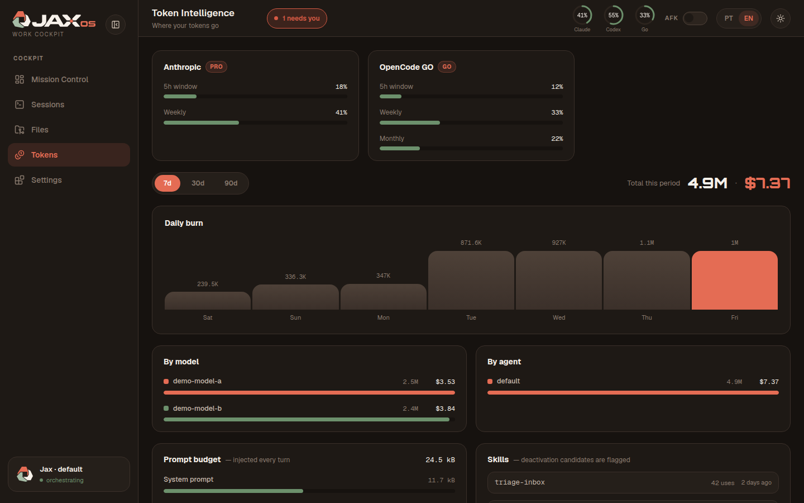
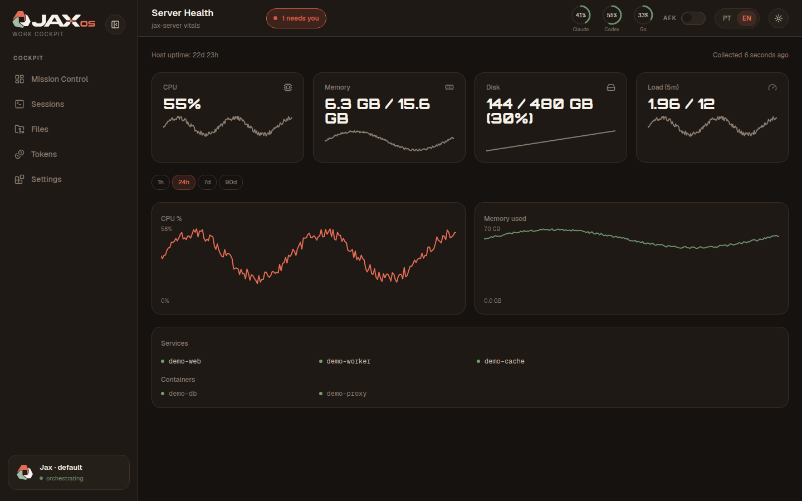
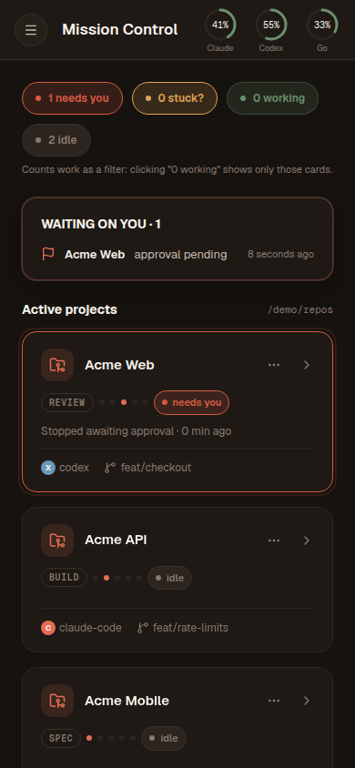

# Jax OS

<p align="center">
  <picture>
    <source media="(prefers-color-scheme: dark)" srcset="public/brand/logo-dark.svg">
    
  </picture>
</p>

> Your agents build in tmux. Jax OS watches them, sends every spec and diff through a cold review by the other model, and asks you before anything merges - from a laptop or a phone.

[](https://github.com/rafachavantes/jax-os/actions/workflows/ci.yml)
[](https://github.com/rafachavantes/jax-os/releases)
[](LICENSE)

<p align="center">
  <picture>
    <source media="(prefers-color-scheme: dark)" srcset="docs/screenshots/mission-control-dark.png">
    
  </picture>
</p>

## Why Jax OS

You already run agents in tmux, an agent UI, maybe Linear. Each one stops short of the question you actually have: what needs me right now?

- **tmux shows panes, not decisions.** You see text scroll, not that an agent stopped and is waiting for you. Jax OS reads the sessions and the agent hooks and tells you who is working, who is waiting and who is done ([`docs/ARCHITECTURE.md`](docs/ARCHITECTURE.md)).
- **Each agent's UI shows one session.** Claude Code, Codex and OpenCode each know only their own run. Mission Control puts every project and every agent on one page.
- **Linear shows tickets, not the branch doing the work.** Each project card shows the stage, branch and tmux session that implement the work; Linear itself is an optional integration.
- **"Stopped" is not "done".** `jaxflow build` re-runs your own `--verify` command before it reports success, instead of taking the agent's word for it ([`workflow/contracts/`](workflow/contracts/)).
- **A merge needs one explicit, logged approval.** `jaxflow merge` runs only after you say yes, and the decision is recorded in the app's own audit log ([`merge-contract.md`](workflow/contracts/merge-contract.md)).
- **Everything stays on your machine.** Loopback bind, one local SQLite file, polling instead of websockets ([`SECURITY.md`](SECURITY.md)).

## How it works

```text
┌──────────┐   ┌─────────────┐   ┌──────────┐   ┌──────────┐   ┌──────────┐
│   spec   │──▶│ cold review │──▶│  build   │──▶│  verify  │──▶│  merge   │
└──────────┘   └─────────────┘   └──────────┘   └──────────┘   └──────────┘
 you + agent    jaxflow review    jaxflow build  build --verify  jaxflow merge
                --spec | --plan                  (re-run by      (needs your
                | --diff                          jaxflow)        approval)
```

A cold review is run by the opposite runtime from the one that wrote the document: a Claude-written spec is judged by Codex, and the reverse, so no model grades its own work. `jaxflow build` reserves its own git worktree, hands the plan to an OpenCode builder and re-runs your `--verify` command itself. `jaxflow merge` waits for your approval. The dashboard watches all of it. More in [`docs/ARCHITECTURE.md`](docs/ARCHITECTURE.md).

## Screenshots

<p align="center">
  
  
  
</p>

Light theme: [Mission Control](docs/screenshots/mission-control-light.png), [Tokens](docs/screenshots/tokens-light.png), [Health](docs/screenshots/health-light.png), [mobile](docs/screenshots/mobile-mission-control-light.png). All screenshots are generated from invented data by `scripts/demo-shots.mjs`.

## Support matrix

| | Dashboard + hook events | `jaxflow build` | `jaxflow review` |
|---|---|---|---|
| Claude Code | yes (hooks) | no | yes |
| Codex | yes (hooks) | no | yes |
| OpenCode | usage meter, no hook | yes (all builder profiles) | no |

Each agent has its own switch in `/settings`. One agent is enough for the dashboard; `build` plus `review` needs OpenCode plus Claude Code or Codex.

## Quick start

```bash
git clone https://github.com/rafachavantes/jax-os.git
cd jax-os
pnpm install --frozen-lockfile
pnpm build
PORT=3100 pnpm start   # then open http://127.0.0.1:3100
```

In a second shell, run `python3 scripts/jaxflow.py doctor`. On a fresh machine it exits non-zero and prints a fix hint for every missing item (wrappers, hooks, skills); [`INSTALL.md`](INSTALL.md) walks through each one. You need Linux with systemd user services, Node and pnpm as pinned in `.nvmrc` and `package.json`, Python 3.11+, tmux, git and rg.

## Core vs. integrations

Everything runs locally on the same host.

- **Core**, no external account: tmux, git, rg, Python; at least one agent CLI (`claude`, `codex` or `opencode`); Files, Mission Control and the `jaxflow` CLI.
- **Integrations**, off until you switch them on in `/settings`: Linear, ttyd, webhook, Hermes tokens, classifier, GitHub, vault.

## Documentation

For users:

| Document | What it covers |
|---|---|
| [**INSTALL.md**](INSTALL.md) | Step-by-step install through `jaxflow doctor` |
| [**docs/ARCHITECTURE.md**](docs/ARCHITECTURE.md) | The rules the system follows and where each one lives |
| [**SECURITY.md**](SECURITY.md) | Trust model, scope and how to report a vulnerability |
| [**CHANGELOG.md**](CHANGELOG.md) | What changed in each release |

For contributors:

| Document | What it covers |
|---|---|
| [**CONTRIBUTING.md**](CONTRIBUTING.md) | Local checks and how a change gets reviewed |
| [**CODE_OF_CONDUCT.md**](CODE_OF_CONDUCT.md) | Expected behavior |
| [**docs/brand.md**](docs/brand.md) | Logo, mark and display font |
| [**workflow/contracts/**](workflow/contracts/) | The role contracts the `jaxflow` runs follow |

## Trust model

Jax OS is built for one owner on one trusted host: no authentication of its own, every listener on `127.0.0.1`, no multi-tenant or public deployment. Put it behind a tunnel only with an auth layer of your own. [`SECURITY.md`](SECURITY.md) states what is in and out of scope.

## Acknowledgements

Built with Claude Code and Codex. The display font is [Orbitron](https://github.com/google/fonts/tree/main/ofl/orbitron) under the SIL Open Font License (`src/fonts/OFL.txt`).

## License

MIT, see [`LICENSE`](LICENSE).
